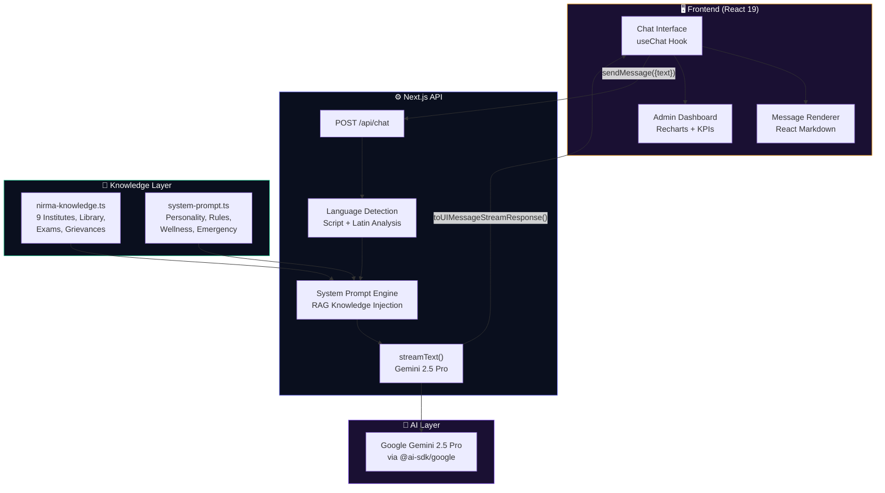

<div align="center">

  <h1>🙏 NirmaSarathi</h1>
  <p><strong>Smart Academic Resource & Administrative Tool for Holistic Interaction</strong></p>
  <p>
    <em>An AI-powered campus assistant that guides every Nirma University student through their academic journey — just like Sarathi guided Arjuna.</em>
  </p>

  <br />

  <!-- Tech Stack Badges -->
  
  
  
  
  
  
  

  <br /><br />

  <!-- Status Badges -->
  
  
  
  

  <br /><br />

  <!-- Quick Links -->
  <a href="#-key-features">Features</a> •
  <a href="#-tech-stack">Tech Stack</a> •
  <a href="#-architecture">Architecture</a> •
  <a href="#-quick-start">Quick Start</a> •
  <a href="#-team">Team</a>

</div>

<br />

---

## 🎯 What is NirmaSarathi?

> **NirmaSarathi** (निरमा सारथी) is an AI-powered campus intelligence platform for **Nirma University, Ahmedabad**. Named after the mythological **Sarathi** (charioteer) who guided warriors to victory, NirmaSarathi guides every student through their academic journey — from library queries to exam schedules, grievance filing, and proactive wellness support.

Unlike generic chatbots, NirmaSarathi is **context-aware**, **multi-lingual**, and **grounded in verified Nirma University data**. It doesn't hallucinate — it only responds from a curated knowledge base covering all 9 Nirma institutes, the KOHA library system, exam structures, and campus facilities.

---

## ✨ Key Features

- 🤖 **Agentic RAG Chatbot** — Powered by Google Gemini 2.5 Pro with a curated knowledge base grounded in verified Nirma University data. No hallucinations.
- 🌐 **Multi-Lingual Intelligence** — Automatic language detection and response in **English**, **Hindi** (हिंदी), and **Gujarati** (ગુજરાતી) with script-level accuracy
- 📚 **Library Intelligence** — Real-time guidance on KOHA catalog, borrowing rules, e-resources (IEEE, Springer, JSTOR), and extended exam-period timings
- 📅 **Exam Scheduling** — CAE-1, CAE-2, MidSem, EndSem dates with proactive reminders and timetable guidance
- 📝 **Smart Grievance Filing** — AI auto-categorizes complaints across 8 categories, routes to correct department, generates unique ticket IDs (GRV-XXX-XXXXX)
- 🫂 **Proactive Wellness Detection** — Sentiment analysis flags stress, anxiety, and distress signals, gently offering counseling resources without being intrusive
- 🚨 **Emergency Protocol** — Instant access to Campus Security, Ambulance (108), Police (112), Women Helpline (181), and Anti-Ragging Helpline
- 📊 **Admin Intelligence Dashboard** — Real-time analytics with animated KPI cards, query trends, grievance tracking, language distribution, and trending topics
- 🎨 **Premium Dark Theme** — Glassmorphism design with saffron-gold cultural accents, micro-animations, and responsive layout
- ⚡ **Streaming Responses** — Real-time token streaming with typing indicators for natural conversational feel
- 👍 **Feedback System** — Thumbs up/down on every response for continuous improvement signals
- 🛑 **Stop Generation** — Interrupt long responses mid-stream

---

## 🛠️ Tech Stack

<div align="center">

| Layer | Technology | Purpose |
|:-----:|:----------:|:--------|
| **Frontend** | Next.js 16, React 19 | App Router, SSR, streaming UI |
| **Language** | TypeScript 5 | End-to-end type safety |
| **Styling** | Tailwind CSS v4 | Utility-first design system |
| **AI Model** | Google Gemini 2.5 Pro | Advanced reasoning, multi-lingual |
| **AI SDK** | Vercel AI SDK v6 | Streaming, message management, UI hooks |
| **Charts** | Recharts 3 | Interactive data visualizations |
| **Icons** | Lucide React | Consistent, tree-shakeable icons |
| **Markdown** | React Markdown | Rich response rendering |
| **Font** | Inter (Google Fonts) | Premium, modern typography |

</div>

---

## 🏗️ Architecture



---

## 💪 What Sets NirmaSarathi Apart

| Feature | Generic Campus Chatbot | NirmaSarathi |
|---------|:----------------------:|:------------:|
| Knowledge Source | Web scraping / LLM hallucinations | ✅ Curated, verified knowledge base |
| Language Support | English only | ✅ EN + Hindi + Gujarati (auto-detect) |
| Wellness Detection | None | ✅ Proactive sentiment analysis |
| Grievance System | Manual forms | ✅ AI auto-categorize + route + track |
| Admin Analytics | None | ✅ Real-time intelligence dashboard |
| Emergency Response | Static FAQ page | ✅ Instant emergency protocol triggers |
| Response Style | Robotic, generic | ✅ Warm, culturally-aware personality |
| Data Accuracy | Uncontrolled | ✅ Zero hallucination — refuses if unsure |

---

## 🚀 Quick Start

### Prerequisites

- **Node.js** ≥ 18.0
- **npm** ≥ 9.0
- **Google Gemini API Key** — Get free at [aistudio.google.com/apikey](https://aistudio.google.com/apikey)

### Installation

```bash
# Clone the repository
git clone https://github.com/Shreekumar-Shah-AICTE/NirmaSarathi.git
cd NirmaSarathi

# Install dependencies
npm install

# Set up environment variables
cp .env.example .env.local
# Add your Gemini API key to .env.local

# Start the development server
npm run dev
```

> 🌐 Open [http://localhost:3000](http://localhost:3000) — Chat with NirmaSarathi!
>
> 📊 Open [http://localhost:3000/admin](http://localhost:3000/admin) — View the Admin Intelligence Dashboard

### Environment Variables

| Variable | Description | Required |
|----------|-------------|:--------:|
| `GOOGLE_GENERATIVE_AI_API_KEY` | Your Google Gemini API key | ✅ |

---

## 📁 Project Structure

```
nirma-sarathi/
├── src/
│   ├── app/
│   │   ├── api/
│   │   │   └── chat/
│   │   │       └── route.ts          # Gemini AI streaming endpoint
│   │   ├── admin/
│   │   │   └── page.tsx              # Admin Intelligence Dashboard
│   │   ├── globals.css               # Premium design system
│   │   ├── layout.tsx                # Root layout with metadata
│   │   └── page.tsx                  # Main chatbot interface
│   ├── data/
│   │   └── nirma-knowledge.ts       # RAG knowledge base (ground truth)
│   └── lib/
│       └── system-prompt.ts          # AI personality & behavioral rules
├── docs/
│   └── screenshots/                  # README screenshots
├── .env.example                      # Environment variable template
├── package.json                      # Dependencies & scripts
├── tsconfig.json                     # TypeScript configuration
└── README.md                         # You are here!
```

---

## 🧠 AI System Design

### Knowledge-Grounded Responses (RAG Architecture)

NirmaSarathi uses a **Retrieval-Augmented Generation** approach where the AI model receives the complete verified knowledge base as context with every query. This ensures:

1. **Zero hallucination** — The model only responds from verified data
2. **Always current** — Knowledge base is maintained as structured TypeScript
3. **Cross-institute coverage** — All 9 Nirma institutes, library (KOHA), exams, grievances, facilities

### Behavioral Rules Engine

The system prompt enforces strict behavioral rules:

| Rule | Behavior |
|------|----------|
| **Language Adaptation** | Auto-detect Hindi (Devanagari), Gujarati, or English |
| **Wellness Triage** | Detect stress/anxiety keywords → offer counseling resources |
| **Emergency Protocol** | Safety threats → immediate emergency contacts |
| **Grievance Routing** | Auto-categorize into 8 types → generate tracking ID |
| **Proactive Assistance** | Volunteer relevant info (exam reminders, library hours) |
| **Accuracy Guard** | Refuse to answer rather than guess |

---

## 📊 Admin Intelligence Dashboard

The admin dashboard provides institutional leadership with real-time insights:

- **6 Animated KPI Cards** — Total queries, active students, open grievances, satisfaction rate, response time, wellness flags
- **Query Volume Trends** — Hourly distribution with area chart
- **Category Distribution** — Pie chart of query topics (Library, Exams, Grievances, etc.)
- **Grievance Heatmap** — Department-wise open/resolved/pending breakdown
- **Language Distribution** — EN/HI/GU usage with progress bars
- **Campus Mood Index** — Aggregate sentiment score
- **Trending Topics** — Most-asked questions with trend indicators
- **Live Conversation Feed** — Real-time student queries with sentiment badges

---

## 🌐 Multi-Lingual Examples

<div align="center">

| Language | User Query | NirmaSarathi Response |
|:--------:|:----------:|:--------------------:|
| 🇬🇧 English | "What are the library timings?" | Full schedule with exam-period hours |
| 🇮🇳 Hindi | "मुझे लाइब्रेरी के बारे में जानकारी दें" | हिंदी में विस्तृत उत्तर |
| 🇮🇳 Gujarati | "પુસ્તકાલય ક્યારે ખુલે છે?" | ગુજરાતીમાં સંપૂર્ણ જવાબ |

</div>

---

## 🏆 Built For

<div align="center">

**IEEE Carnival Ideathon 2026**
*"Innovating the Campus of Tomorrow"*

Organized by IEEE Student Branch, Nirma University (IEEE SBNU)

**Problem Statement**: AI-Powered Campus Assistant

</div>

---

## 👥 Team

<div align="center">

|  |  |
|:---:|:---:|
| **Shreekumar Shah** | **Akshat Nayak** |
| [@Shreekumar-Shah-AICTE](https://github.com/Shreekumar-Shah-AICTE) | Teammate |
| Full-Stack Development, AI Architecture, System Design | Deployment & Testing |

**Team Oasis** 🌴

</div>

---

## 📄 License

This project was built for the IEEE Carnival Ideathon 2026 at Nirma University.

---

<div align="center">
  <br />
  <strong>🙏 NirmaSarathi — Guiding Every Student's Journey</strong>
  <br />
  <em>Built with ❤️ by Team Oasis at Nirma University, Ahmedabad</em>
  <br /><br />
  
</div>
